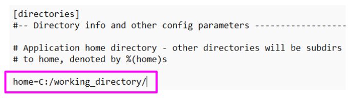
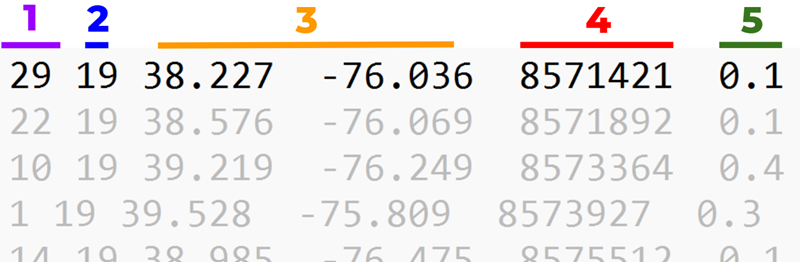
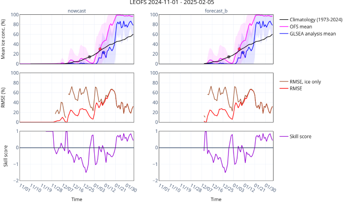

# The Next Gen NOS Ocean Forecast Model Skill Assessment and Processing Software - Prototype
# 1. Overview

This repository contains a prototype of the Next Gen NOS Ocean Forecast Model Skill Assessment and Processing Software, currently under development by NOAA's Center for Operational Oceanographic Products and Services (CO-OPS) and Office of Coast Survey (OCS) as part of the Bipartisan Infrastructure Law (BIL) Coastal and Inland Flood Inundation Mapping (CIFIM) project.

NOAA develops and maintains several [Operational Forecast Systems (OFS)](https://tidesandcurrents.noaa.gov/models.html "Operational Forecast System (OFS) NOAA main page") that provide nowcast (past 24 hours to present time) and forecast (up to 120 hours in the future) guidance of water level, current velocity, salinity, water temperature, and sea ice concentration for a given area. Oceanographic output from OFSs can be used for, for example, shipping channel navigation, search and rescue, recreational boating and fishing, and tracking of storm effects. OFSs are located in coastal waters around the nation, including the Great Lakes, to support critical ports, harbors, and infrastructure. Model predictions and guidance should therefore be as skillful as possible.    

The Next Gen NOS Ocean Forecast Model Skill Assessment and Processing Software, explained here, will provide near real-time evaluation of OFS model skill by comparing model guidance to observations at specific point locations (e.g., established buoys and gauges) and across entire two-dimensional OFS domains using remote sensing products. This new Python-based skill assessment software will replace the [existing Fortran-based NOS skill assessment software](https://tidesandcurrents.noaa.gov/ofs/publications/CS_Techrpt_024_SkillAss_WLsCUs_2006.pdf "Existing skill assessment details"). A map-based interface to view skill assessment results produced by this software will also be available, but is not detailed here.

The Next Gen NOS Ocean Forecast Model Skill Assessment and Processing Software consists of four main modules, each built on modular Python scripts:

👉 __Acquisition of observational data__, including water level, water temperature, salinity, current velocity, and sea ice concentration from NOAA, USGS, and NDBC databases;

👉 __Postprocessing of Operational Forecast System (OFS) model outputs__, including nowcasts and forecasts of the oceanographic variables listed above, to match user inputs for time span and location;

👉 __Skill assessment of OFS model performance__ compared to observational data, using skill statistics such as root mean square error, bias, and correlation coefficients; 

👉 __Data visualization__ in interactive plots, with time series of model output compared to observations, as well as boxplots of each time series and maps of 2D statistics.

## Additional resources

:bulb: Links for further reading:

[Main NOAA OFS page](https://tidesandcurrents.noaa.gov/models.html)

[NOAA OFS Publications](https://tidesandcurrents.noaa.gov/ofs/model_publications.html)

[Original OFS skill assessment technical report (2003)](https://tidesandcurrents.noaa.gov/ofs/publications/CS_Techrpt_017_SkillAss_Standards_2003.pdf)

[Original OFS skill assessment GitHub repository](https://github.com/NOAA-CO-OPS/NOS-OFS-Skill-Assessment-Code.git)

#### NOAA Open Source Disclaimer
<sub><sup>This repository is a scientific product and is not official communication of the National Oceanic and Atmospheric Administration, or the United States Department of Commerce. All NOAA GitHub project code is provided on an ?as is? basis and the user assumes responsibility for its use. Any claims against the Department of Commerce or Department of Commerce bureaus stemming from the use of this GitHub project will be governed by all applicable Federal law. Any reference to specific commercial products, processes, or services by service mark, trademark, manufacturer, or otherwise, does not constitute or imply their endorsement, recommendation or favoring by the Department of Commerce. The Department of Commerce seal and logo, or the seal and logo of a DOC bureau, shall not be used in any manner to imply endorsement of any commercial product or activity by DOC or the United States Government.</sup></sub>

#### License
<sub><sup>Software code created by U.S. Government employees is not subject to copyright in the United States (17 U.S.C. �105). The United States/Department of Commerce reserve all rights to seek and obtain copyright protection in countries other than the United States for Software authored in its entirety by the Department of Commerce. To this end, the Department of Commerce hereby grants to Recipient a royalty-free, nonexclusive license to use, copy, and create derivative works of the Software outside of the United States.</sup></sub>

#### Contact
<sub><sup>Contact: co-ops.userservices@noaa.gov </sup></sub>


# 2. Installation<a name="introduction"></a>
This software can run in any environment that supports Python, including Windows and Linux. Users may use environments such as Anaconda, Pipenv or just  Python without any environment and may need to adjust specific steps in the instructions below for their operating system/environment. Here, we will set up the skill assessment software using Anaconda to process a set of example data that includes both model output and observations. This tutorial is intended for beginning users who have light -- or no -- familiarity with Python, Anaconda, and GitHub.

## 2.1 Download or clone the repository
There are two main ways to create a local copy of the skill assessment repository: downloading and cloning. Cloning will retain the repository development (commit) history and a direct connection between the local and remote repositories. It is recommended if you'd like to, for example, easily keep your local repository up-to-date with changes to the remote repository, be able to access all development branches, or are developing the software. Downloading does not retain development history or a direct connection between the local and remote repository, and only contains the main code branch. It is better suited for users who are not developing the software, and is easier to set up. However, you will need to re-download the entire package each time it is remotely updated on GitHub. 

To clone, you will first need to install [Git Bash](https://git-scm.com/downloads). For NOAA users, it is an approved software package that can be self-installed. After installing Git Bash, [use SSH to clone and create a local repository](https://docs.github.com/en/repositories/creating-and-managing-repositories/cloning-a-repository#cloning-a-repository). After cloning, you can use Git Bash to navigate the repository, including downloading (pulling) new updates and viewing all branches.

To download, simply click the green 'Code' dropdown button on the main page of the skill assessment repository. In the drop down menu, select Download ZIP, and unzip it to the location where you'd like to run the software. 


After cloning or downloading, you will see a directory structure like this:


The main, top-level directory that contains 'bin', 'conf', etc. will be referred to below as your `working directory`. The table below summarizes the directories and files that are inside your `working directory`. _(Note --> there is a directory and a file named '.git*' in the main directory, and they're not needed to run the skill assessment. So you can ignore those for now!)_

|Directory or file|Purpose|
|:---|:---|
|bin|directory that holds all of the python code, grouped in four sub-directories that correspond to the four skill assessment modules: observation retrieval, model post-processing, calculation of skill statistics, and visualization.|
|conf|directory that holds software configuration and data files. You will need to edit 'logging.conf' and 'ofs_dps.conf' before running the software (see [Section 3.3](#33-updating-the-conf-and-logging-files)).|
|log|directory that holds logging output in a text file ([Sections 3.3](#33-updating-the-conf-and-logging-files) and [3.5.7](#357-logging)).|
|ofs_extents|directory that holds shapefiles used for defining the spatial extent of each OFS.|
|readme_images|directory that holds the images you see in this README 😎|
|environment.yml|file used to create your Anaconda (or just Conda) environment in [Section 2.3](#23-create-an-environment-with-anaconda)|
|LICENSE.TXT|text file with software license information.|
|README.md|markdown file of this README 😎|

## 2.2 Download example data
[Download the example OFS model data](https://drive.google.com/file/d/1x0fikZGMLt849ZFwl9Qym0NN1kDh-hRi/view?usp=sharing "example_data.zip"). The example data contains model output (sea surface temperature, salinity, current velocity, water levels) over one day (11/29/2023 - 11/30/2023) for the Chesapeake Bay OFS (cbofs). 

Extract the contents of example_data.zip into your `working directory`. The directory structure within the zip file needs to be preserved when you unzip, otherwise the skill assessment will not see the files. After you unzip the example data, your directory structure should be:

```
working directory/example_data/cbofs/netcdf/...
```

## 2.3 Create an environment with Anaconda
We will use **Anaconda** to manage our Python environment and run the software's Python modules. While some programming platforms (Matlab, for example) are natively equipped to handle complex arrays, equations, and geospatial data, Python is not. As a result, the user must install different packages to the python interface that enable it to handle arrays, equations, and geospatial data, among many other things. Anaconda easily loads and organizes these Python packages for you, and bundles them together into customizable, loadable environments. An environment that loads all Python packages required for the skill assessment software is included below with a set of example data.

Now Install Anaconda, which will also install Python. Anaconda can be [downloaded freely](https://www.anaconda.com/download/). If you are a NOAA employee, you can self-install from the approved software list, or ask your friendly local IT professional.

You can now use the Anaconda Powershell Prompt or Anaconda Prompt to execute commands, and install the necessary Python packages in an environment. Open the Anaconda Prompt. Use the `cd` (change directory) command to navigate to your `working directory` where the 'environment.yml' file is located.

Next, in the Anaconda prompt, create a new environment named `ofs_dps_env` from the 'environment.yml' file by entering:
```
conda env create --name ofs_dps_env --file=environment.yml
```
Then activate your new environment:
```
conda activate ofs_dps_env
```
All of the required packages have now been installed and are self-contained in an environment called `ofs_dps_env`. __Always make sure the environment is activated before running the software.__

# 3. How to run the skill assessment package
Below, you will find instructions for how to complete a skill assessment run using example data. In the example, nowcast and forecast OFS model guidance are compared against observations of all water level, water temperature, salinity, and currents stations within the Chesapeake Bay Operational Forecast System (CBOFS) over 1 day (November 29-30, 2023).

## 3.1 Nowcasts, forecasts, and skill assessment modes
Each OFS provides guidance over two distinct time periods: a **nowcast** and a **forecast**. Nowcasts and forecasts are predictions about the past, present, and future states of water levels, currents, salinity, temperature, and ice concentration. A nowcast incorporates recent (and often near real-time) observed meteorological and oceanographic data. A nowcast covers the period of time from the recent past (e.g., the past few days) to the present, and it can make predictions for locations where observational data are not available. A forecast, on the other hand, incorporates meteorological and oceanographic forecasts to make predictions into the future for times where observational data will not be available. A forecast is usually initiated by the results of a nowcast.

Each OFS runs at specific times each day. For example, the Chesapeake Bay OFS (CBOFS) runs four times each day, at 00Z, 06Z, 12Z, and 18Z. Each of these runs is called a cycle. For each of the four cycles, CBOFS produces nowcast guidance from 6 hours prior to the cycle hour up to the cycle hour, and forecast guidance from the cycle hour to 48 hours after the cycle hour. For a CBOFS 12Z model cycle, for instance:


Different OFSs can have different model cycles times for each day, and different forecast guidance lengths. For example, the West Coast OFS (WCOFS) has only one model cycle each day at 03Z, and provides forecast guidance out to +72 hours. The Lake Erie OFS (LEOFS) has four cycles each day at 00Z, 06Z, 12Z, and 18Z, and provides forecast guidance out to +120 hours.   

The skill assessment can run within or across model cycles in three different modes: forecast_a, forecast_b, and nowcast. All modes can be run individually or together. To run the software, at least one mode must be selected ([Section 3.4](#34-running-the-software)).

|Mode|Explanation|
|:---|:---|
|forecast_a|uses OFS forecast output for one complete user-selected forecast cycle. The start and end dates correspond to the start and end of a model forecast cycle.|
|forecast_b|uses OFS forecast output between user-selected start and end dates. The forecast output is stitched together from successive forecast cycles to make a time series of arbitrary lengths, and the start and end dates do not need to correspond to model cycles.|
|nowcast|uses OFS nowcast output between user-selected start and end dates. The nowcast output is stitched together from successive nowcast cycles to make a time series of arbitrary lengths, and the start and end dates do not need to correspond to model cycles.|

The most commonly used modes are nowcast and forecast_b. No information regarding forecast cycles is needed to run them -- you only need to input the OFS, a start date, and an end date (see [Section 3.4](#34-running-the-software)). Nowcast and forecast_b modes can easily be run together when using the skill assessment. 

For forecast_a, you input the OFS, start date, and model cycle to run the skill assessment ([Section 3.4](#34-running-the-software)). The end date is an optional user input and is determined by the OFS forecast horizon. For example, CBOFS has a forecast horizon of 48 hours. A CBOFS skill assessment run for the 06Z cycle on 01/01/2025 would have an automatic end date of 06Z 01/03/2025, as that is the end of the model forecast cycle. 

Forecast_a, therefore, has a pre-defined end date, while forecast_b and nowcast have flexible, user-selected end dates. To resolve this conflict, **when using nowcast and/or forecast_b together with forecast_a, the end date of forecast_a will always take precedence.**

## 3.2 OFS data formats
Nowcast and forecast OFS output is available in multiple data formats. The two primary formats -- and the ones we will use here -- are 'fields' files and 'stations' files. Fields files contain two- or three-dimensional arrays containing spatially distributed model output, with hourly time resolution. Stations files contain one-dimensional time series of model output _at selected locations within an OFS_, with 6-minute time resolution.

In terms of the skill assessment software, the functional differences between fields and stations file formats are:
* **Fields files** have 2D model output in a grid across the entire OFS domain, and can be matched with any observation station locations. But they are generally larger in file size and more cumbersome to work with -- the skill assessment runs slower with fields files than with stations files. Fields files are required for 2D analysis in the skill assessment.
* **Stations files** have 1D time series output only at selected locations within an OFS, which cannot always be matched with all available observation station locations. However, stations files are much smaller in size, more nimble to work with, and have a higher 6-minute time resolution. The 1D skill assessment can be run up to 10x faster with stations files compared to fields files. Stations files cannot be used for 2D skill assessment.

Here, we will be assessing the skill of nowcast and forecast model guidance using both fields and stations files. Fields and stations files (each with nowcast and forecast model guidance) are included in the example data you downloaded in [Section 2.2](#22-download-example-data). When using the skill assessment software, the user can choose which file format and which 'cast' (nowcast or forecast) to use ([Section 3.4](#34-running-the-software)).

## 3.3 Updating the conf and logging files
In the `working directory`, there is a sub-directory called 'conf'. In 'conf', there are two configuration files that must be updated before running the skill assessment software. 'ofs_dps.conf' establishes the directory structure that the skill assessment uses to read inputs and write outputs. The second file, 'logging.conf', determines how the skill assessment collects logging entries -- used mainly for debugging -- as the software runs. You can read more about logging in [Sections 3.5.7](#357-logging) and [5](#5-troubleshooting).   

To edit each configuration file, open them in a text editor (e.g., Notepad).
* **'ofs_dps.conf'**: type the path to your `working directory` in the line that starts with "home=". For example "home=C:/working_directory/".



* **'logging.conf'**: here, you can choose whether to save logging entries to a text file or print them to screen as the software runs. The default is print to screen. If instead you want to save logging entries to a text file, use a hash (#) to comment out "handlers=screen" in the 'logger_root' section (pink #1 arrow), and "keys=screen" in the 'handlers' section (blue #2 arrow). Then, in the same sections, uncomment the lines that say "handlers=fileHandler" and "keys=fileHandler". If saving logging entries to a text file, 'logging.conf' should look like this:


## 3.4 Running the software
Now we're ready! Make sure the 'ofs_dps_env' environment is activated (type 'conda activate ofs_dps_env'), then in the Anaconda Prompt, navigate to your `working directory`. You must always run the software from there.

The following skill assessment run will use the example data ([Section 2.2](#22-download-example-data)) with nowcast and forecast_b modes. _Forecast_a mode will not work with the example data_ (See [Section 6](#6-usage-with-other-ofs-data) for downloading additional OFS model output).  

You can start a skill assessment run by typing

```
python ./bin/visualization/create_1dplot.py -p ./ -o cbofs -s 2023-11-29T00:00:00Z -e 2023-11-30T00:00:00Z -d MSL -ws [Nowcast,Forecast_b] -t fields
```
where 
* _-o_ is the name of the OFS (in this case, CBOFS)
* _-p_ is the path to `working directory` (which you are currently in, thus it is followed by './')
* _-s_ and _-e_ are the start and end dates, respectively
* _-d_ is the vertical datum used to retrieve water level observations
* _-ws_ is the mode (nowcast, forecast_a, and/or forecast_b)
* _-t_ is the file format/type (stations or fields).

So, this run is for CBOFS, from 11/29/23 to 11/30/23, using both nowcast and forecast OFS output with stations files (and 6-minute time resolution), with a vertical datum (used only for water levels) of mean sea level. 

All possible input options and arguments are summarized in the table below.

| Option explanation | Option syntax | Verbose syntax | Arguments | Required/optional |
|:---:|:---:|:---:|:---:|:---:|
|Show help messages and exit |-h|--help|none|optional|
|Which OFS location<br><sub>([map of OFS locations](https://tidesandcurrents.noaa.gov/models.html))</sub> |-o|--ofs|cbofs, ciofs, dbofs, gomofs, leofs, lmhofs, loofs, lsofs, ngofs2, nyofs, sfbofs, sjofs, sscofs, tbofs, wcofs|required|
|Path to `working directory`|-p|--path|e.g., C:\path\to\working_directory|optional|
|Start date for assessment|-s|--StartDate|YYYY-MM-DDTHH:MM:SSZ<br>(e.g. 2023-11-29T00:00:00Z)|required|
|End date for assessment|-e|--EndDate|YYYY-MM-DDTHH:MM:SSZ<br>(e.g. 2023-11-30T00:00:00Z)|optional if using forecast_a,<br>required otherwise|
|Reference tidal datum for water level<br><sub>([List of tidal datums](https://tidesandcurrents.noaa.gov/datum_options.html))</sub>|-d|--datum|MHHW, MHW, MTL, MSL, DTL, MLW, MLLW, NAVD, STND|required|
|Mode, or 'cast'|-ws|--WhichCast|nowcast, forecast_a, forecast_b|required<br><sub>(can use one or all)</sub>|
|OFS file format|-t|--FileType|'stations' or 'fields'|optional<br><sub>(default is stations)</sub>|
|Forecast cycle hour<br><sub>(for use only with forecast_a mode)</sub>|-f|--Forecast_Hr|e.g. '06hr', '12hr'|optional<br><sub>(default is '00hr', or closest cycle to '00hr')</sub>|

## 3.5 Outputs
During a run, the skill assessment creates a 'data' directory to save all skill-related outputs. Within the data directory, outputs are saved in separate sub-directories depending on output type, including 'observations', 'model', 'skill', and 'visual'. 

A 'control_files' directory is also created by the skill assessment in your `working directory`. Here, text files list available observation stations for each oceanographic variable (e.g., temperature, salinity, current velocity, and water level), as well as the spatially matched OFS output locations for each variable. **Typically, you do not need to interact with these files,** but they are useful if, for example, you want to know the latitude and longitude of each observation station, or what OFS grid cell spatially corresponds to each observation station.

The following sections will cover each output directory in detail.

🚨🚨🚨 **After a skill assessment run, it is recommended to delete, rename, or relocate the 'data' and 'control_files' directories before starting a new skill assessment run. Otherwise you may encounter errors, and the skill assessment may crash (See [Section 5, Troubleshooting](#5-troubleshooting)).** 

### 3.5.1 Control files 
`/working_directory/control_files`

The control files are used by the software to match observation stations with model output. During a skill assessment run, eight control files are created: one for each oceanographic variable -- temperature (temp), salinity (salt), water level (wl), and current velocity (cu) -- for both observations and model output.

Control file types and naming conventions are:

* **{OFS}_{variable}_station.ctl**: control file for observation stations, where {OFS} is the user-selected OFS, and {variable} is the oceanographic variable. For example, `cbofs_wl_station.ctl` would be a control file for CBOFS that lists observation stations for water level (wl). Information about each observation station is split into two rows. An example, with the first entry numbered, from the Salish Sea and Columbia River OFS (SSCOFS) is below.


    1. Station ID
    2. Station info, including station ID, variable, OFS, and station provider
    3. Station name
    4. Latitude & longitude
    5. Datum shift used only for water level. Column is assigned 0.0 if vertical datum is MLLW. If datum is not MLLW, the datum shift in meters is listed here. 
    6. Station water depth in meters
    7. Placeholder, always assigned 0.0

* **{OFS}_{variable}_model{_station}.ctl**: control file for model output, where {OFS} is the user-selected OFS, {variable} is the oceanographic variable, and {_station} indicates if the control file was generated using the stations ouptut file format (see [Section 3.1](#31-nowcasts-forecasts-and-skill-assessment-modes)). The {_station} option is left blank if the fields file format is used in the skill assessment. For example, `cbofs_wl_model_station.ctl` is a CBOFS control file generated from stations files that lists water level model output locations. `cbofs_wl_model.ctl` is a CBOFS control file generated from fields files that lists water level output locations. Internally, model control files for fields and stations file formats both contain the same information and are formatted the same way -- the only difference is the file name. An example model control file from SSCOFS is below. Each row contains information on the model location that matches the observation location. 



    1. Example of an entry/row where there is no matching model output location for an observation station. In this case, missing data are filled with -999.  
    2. For stations files, this is the index of the model time series that matches the observation station location. For fields files, this is the node (or grid cell) that matches the observation locations.
    3. Index of model sigma layer that best matches the observation station water depth.
    4. Latitude & longitude of the model output location
    5. Observation station ID that corresponds to model output location
    6. Placeholder, always assigned 0.0

### 3.5.2 Plots 
`/working_directory/data/visual/`

When the software is finished running, interactive plots and maps are saved in '/data/visual/'. Plots of observed and modeled salinity ('salt'), water temperature ('temp'), water levels ('wl'), and current velocity ('cu') are included for each observation station in CBOFS. A file titled

_cbofs_44041_17354_cu_vector1_nowcast_forecast_b.html_

is for observation station 44041 in the CBOFS OFS, using model node 17354, and is a plot of current velocity ('cu', which is a vector quantity), and includes both nowcast and forecast model output.

The plots are interactive. Clicking or double-clicking on the legend items will hide or show the different time series (forecast, nowcast, observations). Hovering your cursor over the box plots on the right-hand side will reveal statistics, such as mean, max, and min values. 

Text files of paired forecast, nowcast, and observational time series used to make the plots are stored in '/working_directory/data/skill/1d_pair/'. You can use these to recreate the plots.


### 3.5.3 Station observations 
`/working_directory/data/observations/1d_station/`

Time series of observed salinity ('salt'), water temperature ('temp'), current velocity ('cu'), and water level ('wl') are stored as text files (.obs) for each observation station in '/working_directory/data/observations/1d_station/'. For scalar variables temperature (degrees C), salinity (practical salinity units, PSU), and water level (meters relative to chosen datum), the column labels are:

| Days elapsed since Jan. 1 | Year | Month | Day | Time (hours) | Time (minutes) | Observation (e.g. salinity) |
|:---:|:---:|:---:|:---:|:---:|:---:|:---:|

For vector variables (current velocity), the observation text file column labels are:

| Days elapsed since Jan. 1 | Year | Month | Day | Time (hours) | Time (minutes) | Current speed (m/s) | Current direction (compass direction, 0-360) |_u_ (east/west) velocity component|_v_ (north/south) velocity component| 
|:---:|:---:|:---:|:---:|:---:|:---:|:---:|:---:|:---:|:---:|

### 3.5.4 OFS model output
`/working_directory/data/model/1d_node/`

Nowcast and/or forecast model time series of salinity, water temperature, current velocity, and water level are stored as text files (.prd) for each CBOFS station in '/working_directory/data/model/1d_node/'. The columns in the model output text files are the same as listed above for the observation data text files.

### 3.5.5 Skill assessment metrics
`/working_directory/data/skill/`

In the '/data/skill' folder, there are two sub-directories: 'stats' and '1d_pair'. Skill assessment metrics are stored in '/working_directory/data/skill/stats/'. There, you will find comma-separated files (.csv) with skill metrics for nowcasts and/or forecasts at each OFS station, calculated over the entire user-defined skill assessment time period. 

Several skill assessment statistics described below, including central frequency and positive/negative outlier frequency, quantify the percentage of errors that fall within or outside of a target error range. Error -- also referred to as bias -- is the difference between model-predicted and observed values such that positive values indicate model over-prediction, and negative values under-prediction. The target error range defines how much error is acceptable. For model performance to be considered acceptable, $\geq90$% of error values should fall within the target range, and $\leq1$% of error values should fall outside of the target error range multiplied by two. For each oceanographic variable, the target error range is: 
* Water level: $\pm \textup{0.15 m}$
* Temperature: $\pm \textup{3&deg;C}$
* Salinity: $\pm \textup{3.5 PSU}$
* Current speed: $\pm \textup{0.26 m/s}$ 

|Statistic|Units|Explanation|
|:---|:---|:---|
|__RMSE__|Same as data being analyzed|Root mean square error (RMSE) is the average difference between model predictions and observations. RMSE quantifies model accuracy: lower values indicate better fit between model predictions and observations, while higher values indicate less model skill. RMSE values are always non-negative.|
|__R__|Dimensionless|The Pearson correlation coefficient (R) measures the linear correlation between model predictions and observations. It is a measure of covariance, where the coefficient can range from -1 to 1. Positive (negative) values reflect a positive (negative) correlation.|
|__Bias__|Same as data being analyzed|Bias, or error, is the mean difference between model predictions and observations. Positive (negative) values indicate model overprediction (underprediction). For currents, which are a vector quantity with both speed and direction, bias is calculated only for speed.|
|__Bias percent__|Percent|Bias percent is the bias divided by the mean of the observations at a given station, multiplied by 100.|
|__Bias direction__|Compass direction, 0-360&deg;|Bias direction is only applicable to current velocity. It is the average difference between model predictions and observations of current direction. Smaller (larger) values indicate higher (lower) model skill in predicting current direction.|
|__Central frequency__|Percent|Central frequency (CF) is the percent of bias/error values that fall within each variable's target error range.|
|__Central frequency pass/fail__|Pass or fail|For a model performance to be considered acceptable, $\geq90$% of errors must fall within the target error range. A 'pass' indicates CF is $\geq90$%, a 'fail' indicates CF is <90%.|
|__Positive outlier frequency__|Percent|Positive outlier frequency (POF) is the percent of bias/error values that is above each variable's target error range multiplied by 2.|
|__Positive outlier frequency pass/fail__|Pass or fail|For a model performance to be considered acceptable, $\leq1$% of errors must fall above the target error range multiplied by two. A 'pass' indicates POF is $\leq1$%, a 'fail' indicates POF is >1%.|
|__Negative outlier frequency__|Percent|Negative outlier frequency (NOF) is the percent of bias/error values that is below each variable's target error range multiplied by 2.|
|__Negative outlier frequency pass/fail__|Pass or fail|For a model performance to be considered acceptable, $\leq1$% of errors must fall below the target error range multiplied by two. A 'pass' indicates NOF is $\leq1$%, a 'fail' indicates NOF is >1%.|
|__Bias standard deviation__|Same as data being analyzed|Bias standard deviation is the standard deviation of all bias/error values.|

In the 'skill/1d_pair' folder, there are text files (.int) with paired observation-model time series data. These text files were used to create the time series plots in /data/visual/. For scalar variables (salinity, water level, and water temperature), the text file columns represent:

| Days elapsed since Jan. 1 | Year | Month | Day | Time (hours) | Time (minutes) | Observation<br>(e.g. salinity) |Model prediction<br>(e.g. salinity)|Bias<br>(predicted minus observed)|
|:---:|:---:|:---:|:---:|:---:|:---:|:---:|:---:|:---:|

For vector variables (current velocity), the columns represent:

| Days elapsed since Jan. 1 | Year | Month | Day | Time (hours) | Time (minutes) | Observed current speed (m/s) |Model-predicted current speed (m/s)|Current speed bias (predicted minus observed)|Observed current compass direction |Model-predicted current compass direction|Current direction bias (predicted minus observed)| 
|:---:|:---:|:---:|:---:|:---:|:---:|:---:|:---:|:---:|:---:|:---:|:---:|

### 3.5.6 Skill maps 
`/working_directory/data/visual/`

[Plotly express](https://plotly.com/python/tile-scatter-maps/) maps for each oceanographic variable -- salinity, water level, current velocity, and water temperature -- are produced by the skill assessment. They show the locations of each observation station within an OFS color-mapped by RMSE between model output and observations. The maps are interactive, so hovering the cursor on a station will show other statistics, too, including central frequency, positive/negative outlier frequency, and mean bias/error.


### 3.5.7 Logging 
`/working_directory/log/`

Logging, which contains errors, warnings, and other run-time info, is either printed to screen or saved in a text file in /working_directory/log/. See [Sections 3.3](#33-updating-the-conf-and-logging-files) to configure logging options. The log is useful for
* debugging and troubleshooting,
* following along or checking in on run progress,
* understanding the structure of the skill assessment,
* and knowing how long it takes different parts of the software to run.

In the log, you will see 'info' entries and 'error' entries. 'Info' provides general updates during a run, such as when files are saved, data is concatenated, or when the software is downloading observational data. 'Error' entries are largely minor road bumps that the skill assessment encounters. You will see error messages when, for example, observational data from a given station is not available for download, or when the skill assessment cannot match an observation station with a model output location. These more minor errors are handled internally and are not problematic. Some errors, however, do cause the program to crash unexpectedly or exit purposefully -- if this happens, the error may not be logged but will be printed to the screen. See [Section 5](#5-troubleshooting) for troubleshooting, including common errors.

# 4. Great Lakes ice skill assessment
There are four OFSs that provide guidance on Great Lakes conditions: LEOFS (Lake Erie), LMHOFS (Lake Michigan and Huron), LOOFS (Lake Ontario), and LSOFS (Lake Superior). Together, these are referred to as the Great Lakes OFS, or GLOFS. GLOFS model guidance for water level, temperature, and current velocity are assessed by the 'main' skill assessment that is described above. However, GLOFS models also provide guidance on ice conditions, including ice concentration and thickness. To assess the skill of OFS ice predictions, there is a dedicated set of ice skill assessment modules within this repository.   

Currently, the ice skill assessment compares modeled and observed **ice concentration** and **extent**. Ice concentration is the percentage of lake surface that is covered by ice, where 0% is open water and 100% is completely ice-covered. Ice extent is the percent of a lake's surface area where ice concentration is $\geq10$%. Ice thickness will be added to the skill assessment in a future update. 

During a model run, for each day, the ice skill assessment:

1) Downloads ice concentration maps from the [Great Lakes Surface Environmental Analysis (GLSEA)](https://coastwatch.glerl.noaa.gov/satellite-data-products/great-lakes-surface-environmental-analysis-glsea/) for the time period of interest, and clips it to an OFS area;
2) Fetches available nowcast and/or forecast GLOFS guidance of ice concentration for the same time period and OFS area;
3) Produces 1D time series of GLSEA and modeled ice concentration with skill statistics at specified locations within the OFS;
4) Interpolates the model output to the regular GLSEA grid, so they are directly comparable;
5) Produces basin-wide skill statistics and 2D skill statistics maps.
   
The GLSEA is a daily remote sensing-derived map of Great Lakes surface water temperature and ice concentration, where the ice concentration is provided by the [National Ice Center](https://usicecenter.gov/Products/GreatLakesHome). GLSEA ice concentration information is provided in 10% increments.

The ice skill assessment uses 2D fields model output files ([Section 3.2](32#-ofs-data-formats)). Because the GLSEA is available daily, and model fields file output is hourly, the assessment chooses one daily fields file for nowcast (hour 6 from the 12Z cycle) and forecast (hour 6 from the 06Z cycle) that best matches the 12Z GLSEA timestamp. When the ice skill is run on the CO-OPS server, the program will automatically select these files. However, if you are running the ice skill locally, you must have the correct files (i.e., correct cycle, hour, and calendar date) downloaded and available in the directory structure described in [Section 2.1](#21-download-or-clone-the-repository).

The ability to assess the skill of a daily time-averaged fields file will be added in a future update.

## 4.1 Running the ice skill assessment
First, follow the steps outlined in [Section 2.1](#21-download-or-clone-the-repository) and [Section 2.3](#23-create-an-environment-with-anaconda). Then, download example data [here](https://drive.google.com/file/d/1d5Wd4M_OQvh_e8UKTv2j-eIYv7n4Y-eX/view?usp=drive_link), and place the folder in the 'example data' directory structure as described in [Section 2.1](#21-download-or-clone-the-repository). The following ice skill assessment example will use nowcast mode, and assess ice skill on Lake Erie (LEOFS) from 01-01-2023 to 01-31-2023. _Forecast_a mode will not work with the ice skill assessment_ (See [Section 6](#6-usage-with-other-ofs-data) for downloading additional OFS model output).

Next, navigate to the 'conf' directory (`/working_directory/conf/`, [Section 2.1](#21-download-or-clone-the-repository)). There you will find a file called _gl_2d_clim.zip_. This is the 2D Great Lakes climatology in [numpy](https://numpy.org/) (.npy) format that the program uses to calculate model skill statistics ([Section 4.2.1](#421-ice-concentration-skill-score)). Unzip _gl_2d_clim.zip_ to your 'conf' directory.    

Make sure the 'ofs_dps_env' environment is activated, then in the Anaconda Prompt, navigate to your `working directory`. You can then start a skill assessment run by typing

```
python ./bin/visualization/do_iceskill.py -p ./ -o leofs -s 2023-01-01T00:00:00Z -e 2023-01-31T00:00:00Z -ws [nowcast]
```
where 
* _-o_ is the name of the OFS (in this case, LEOFS (Lake Erie))
* _-p_ is the path to `working directory` (which you are currently in, thus it is followed by './')
* _-s_ and _-e_ are the start and end dates, respectively, in the same format as the main skill assessment
* _-ws_ is the mode (nowcast and/or forecast_b)

### 4.1.1 Internal options & flags
There are several variables within _do_iceskill.py_ that control plot and map output, time step, and run mode. These required variables are assigned default values, and can be changed to the specific options listed below.

|<sub>Variable</sub>|<sub>Options</sub>|<sub>Explanation</sub>|
|:---|:---|:---|
|<sub>shouldimakemaps</sub>|<sub>'yesplease' or 'nothanks'</sub>|<sub>Controls whether or not the program will write static (.png) and JSON maps to file. The default setting is 'yesplease'.</sub>|
|<sub>shouldimakeplots</sub>|<sub>'yesplease' or 'nothanks'</sub>|<sub>Controls whether or not the program will write plots to file. The default setting is 'yesplease'.</sub>|
|<sub>dailyplotdays</sub>|<sub>number of days (integer)</sub>|<sub>The ice skill assessment can make a map for each day showing the observed and modeled ice concentrations, as well as error between them. 'dailyplotdays' sets the number of days prior to the end date that the program will generate daily maps. For example, the default setting dailyplotdays=10 will generate daily maps for the last 10 days of a skill assessment run. To turn off daily maps, set dailyplotdays=0. To make daily maps for each day, set dailyplotdays equal to the total number of days in your skill assessment run.</sub>|
|<sub>seasonrun</sub>|<sub>'yes' or 'no'</sub>|<sub>'Seasonrun' must be updated to 'no' before running the ice skill assessment. It is intended only for the scheduled runs on the CO-OPS server that generate daily output for the skill assessment webapp. 'Seasonrun' allows the start date to be pinned at the beginning of the ice season (11/01), and the end date to be updated daily. It also handles the uneven availability of nowcast and forecast fields files during the ice season, effectively ignoring any missing data files.</sub>|

## 4.2 Ice skill statistics
Statistics that describe the skill of the OFS model guidance relative to observations are described below.  

|Statistic|Units|Explanation|
|:---|:---|:---|
|__RMSE__|Same as data being analyzed|Root mean square error (RMSE) is the average difference between model predictions and observations, and is always non-negative. For ice skill, it is calculated in two ways: 1) for all grid cells in an OFS, including cells where there is open water (no modeled or observed ice), and 2) for grid cells where there is either modeled or observed ice (i.e., excluding open water cells). The former RMSE statistic is referred to as 'RMSE', while the latter is 'RMSE, ice only'.|
|__R__|Dimensionless|The Pearson correlation coefficient (R) measures the linear correlation between model predictions and observations.|
|__Mean error__|Same as data being analyzed|Mean error, or bias, is the mean difference between model predictions and observations. Positive (negative) values indicate model overprediction (underprediction).|
|__Max error__|Same as data being analyzed|Max error is the maximum difference between model predictions and observations.|
|__Min error__|Same as data being analyzed|Min error is the minimum difference between model predictions and observations.|
|__Ice days__|Number of days|The cumulative number of days that ice concentration is $\geq10$%.|
|__Ice onset & thaw dates__|Calendar date|Ice onset is the first time during an ice season that the average lake-wide ice concentration exceeds 10% for 5 consecutive days. Ice thaw is the last time during an ice season that the average lake-wide ice concentration drops below 10% for 5 consecutive days.|
|__Skill Score__|Dimensionless|The Skill Score ([Hebert et al., 2015](https://agupubs.onlinelibrary.wiley.com/doi/abs/10.1002/2015JC011283)) evaluates if model guidance or long-term climatology better matches observations of ice concentration. Please see [Section 4.2.1](#421-ice-concentration-skill-score) below for more details.|
|__Critical Success Index__|Dimensionless|The Critical Success Index (CSI) quantifies the spatial overlap between modeled and observed ice extent. Please see [Section 4.2.2](#422-ice-extent-critical-success-index) below for more details.|

### 4.2.1 Ice concentration Skill Score
The **Skill Score** evaluates if model guidance or long-term climatology better matches observations of ice concentration. It is defined as:

$\textup{Skill Score} = 1 - \frac{MSE(mod-obs)}{MSE(clim-obs)}$

where 
* **_MSE(mod-obs)_** is the mean squared error (MSE) between modeled and observed ice concentration, and
* **_MSE(clim-obs)_** is the MSE between climatology and observations.

The 2D climatology used in the Skill Score was compiled from >10,000 daily GLSEA datasets between 1995 and 2024. Each day within the ice season (11/01 - 05/31) was averaged across all years, resulting in a daily long-term average for each calendar day. 

Possible values and ranges of Skill Scores, and how to interpret them, are listed below. Skill Scores that would indicate skillful OFS model guidance are green, while Skill Scores that would indicate less skillful OFS model guidance are red.

${\color{green}\textup{Skill Score = 1}}$: A 'perfect' model prediction where $MSE(mod-obs)$ equals zero.

${\color{green}\textup{0 < Skill Score < 1}}$: $MSE(mod-obs)$ is less than $MSE(clim-obs)$, indicating model guidance is more skillful than climatology at matching observations.

${\color{red}\textup{Skill Score = 0}}$: $MSE(mod-obs)$ equals $MSE(clim-obs)$, indicating model guidance and climatology are equally skillful at matching observations.

${\color{red}\textup{Skill Score < 0}}$: $MSE(mod-obs)$ is greater than $MSE(clim-obs)$, indicating that climatology is more skillful than model guidance at matching observations.

### 4.2.2 Ice extent Critical Success Index
The Critical Success Index (CSI) quantifies the spatial overlap between modeled and observed ice extent. It is given by:

$\textup{CSI} = \frac{\textup{hits}}{\textup{hits + false alarms + misses}}$

where 
* **_hits_** is the total number of grid cells where there is both predicted and observed ice;
* **_false alarms_** is the total number of grid cells where the model predicted ice, but ice was not present in the observations;
* **_misses_** is the total number of grid cells where the model did not predict ice, but ice was present in the observations.

The CSI ranges from 0 to 1. A value of 1 means the model correctly predicted the presence of ice in 100% of the grid cells where observed ice was present, and nowhere else. A value of 0.5, for example, would mean that the model correctly predicted ice in 50% of the cells where either modeled or observed ice was present, and the remaining 50% is false alarms and/or misses.

## 4.3 Ice skill outputs
After the ice skill package runs, it will output a series of plots, maps, and text files. The skill statistics within these files are described in [Section 4.2](#42-ice-skill-statistics). All ice skill outputs are saved in different ice-specific directories, and each directory is housed within the master 'data' directory [Section 2.1](#21-download-or-clone-the-repository). Paths to each output type are listed in the sections below.

### 4.3.1 Station plots
`/working_directory/data/visual/ice_visual/time_series/`

Time series of modeled and observed ice concentrations are plotted at CO-OPS, NDBC, and USGS observation stations within an OFS. _Note that these stations do not provide ice concentration observations. Instead, ice concentration time series from the two-dimensional GLSEA dataset and OFS model output are extracted at each station location, which serve as common cross-reference points between the ice and main skill assessments._ An example station time series plot is below.


The plot title displays the
* user-selected OFS;
* Node ID, or model node from which the time series was extracted that is closest to the observation station;
* Station ID, or unique identifier of the observation station location where the GLSEA and model time series were extracted;
* and the start and end dates for the skill assessment run.

In the plot, GLSEA is shown in light blue; nowcast guidance is light green; and forecast guidance is dark green. Shaded areas on either side of the model time series show how the ice concentration varies in the local neighborhood around the model node. The 'neighborhood' is defined here as a radius of 2 model nodes around the model node of interest, and the shaded areas are defined as $\pm$ 1 standard deviation of the mean of the local neighborhood. 

The time series used to make the station plots are saved in text file format in `/working_directory/data/skill/1d_ice_pair/`. You can use these to make time series of your own, or calculate different skill statistics.

Skill metrics for each 1D time series are saved in a .csv file in `/working_directory/data/skill/stats/ice_stats/`. The table includes the observation station ID where the time series are extracted, the model node closest to the observation station, several skill statistics ([Sections 3.5.5](#355-skill-assessment-metrics) and [4.2](#42-ice-skill-statistics)), and the start and end date of the skill assessment run.


### 4.3.2 Basin-wide statistics plots 
`/working_directory/data/visual/ice_visual/stats/`

The basin-wide plots show time series of ice concentration and extent statistics calculated over all grid cells in an OFS. See [Section 4.2](#42-ice-skill-statistics) for descriptions of all statistics. Text files of the statistics time series used to make these plots, including ice onset and thaw dates, are saved to `/working_directory/data/skill/stats/ice_stats/`.

Ice concentration plots include mean model and observed ice concentrations (with $\pm$ 1 standard deviation about the means), RMSE, and Skill Score for both nowcast and forecast. Ice onset and thaw dates, as well as long-term climatology, are also included on the ice concentration plots. The ice concentration climatology used here is from [GLERL Great Lakes CoastWatch](https://coastwatch.glerl.noaa.gov/statistics/great-lakes-ice-concentration/), and is the average daily ice concentration between 1974-2024 for a given OFS. (_Note that this 1D climatology is different than the 2D climatology used to calculate the Skill Score_ ([Section 4.2.1](#421-ice-concentration-skill-score))_, which is between 1995 - 2024._)

The RMSE is calculated in two ways. In the plot below, the RMSE red line is for all grid cells in an OFS, including cells where there is open water (no modeled or observed ice). RMSE in open water cells is by definition equal to zero, and can bias the RMSE downwards. The brown line, 'RMSE, ice only', is for grid cells where there is either modeled or observed ice, and excludes open water cells. Unless the OFS is fully covered by ice, 'RMSE, ice only' is higher than regular 'RMSE', as the downward bias is removed. 




Ice extent plots show model and observed ice extents, ice extent error, and Critical Success Index for both nowcast and forecast.


### 4.3.3 Static maps
`/working_directory/data/visual/ice_visual/static_maps/`

There are two types of maps produced by the ice skill assessment: daily and summary statistics. Each type is produced separately for nowcast and forecast model guidance.

Daily maps show modeled ice concentration, observed (GLSEA) ice concentration, and ice concentration error (model minus observed) for a single time step. The daily map below shows conditions on Lake Erie for 01/31/2025.


In addition to daily plots, there are four static map files that show summary statistics tabulated across the entire skill assessment run:
* Ice days, showing the total number of days that modeled and observed ice concentration was $\geq10$%;
* Mean ice concentration for both modeled and observed ice, as well as RMSE (example shown below on the left);
* Frequency of hits, misses, and false alarms (see Critical Success Index, [Section 4.2.2](#422-ice-extent-critical-success-index) -- example shown below on the right);
* Mean, max, and min ice concentration errors where error is defined as model minus observation.


### 4.3.4 JSON maps
`/working_directory/data/visual/ice_visual/json_maps/`

All static maps described above are also available in JSON format.

# 5. Troubleshooting
The most common cause of skill assessment run-time errors and failures is having 'data' or 'control_files' directories that are from a previous skill assessment run. If the program crashes or exits, first try deleting the 'data' and/or 'control_files' directories, and then re-run the program. If the error persists,
1) check the log file for any 'ERROR' entries. If there is appropriate internal handling of the error, then a log entry will be created for it with a message explaining what went wrong;
2) check if the program is fetching model output files from the correct directory, and there are model output files in those directories;
3) make sure you are calling the program to run from your `working directory`.

If it is an unexpected error and is not logged, save the error message that was printed to screen and a member of the skill assessment team can help solve the problem. Common errors and troubleshooting advice are listed in the table below.

|Error or problem|Likely explanation|How to fix it|
|:---|:---|:---|
|Skill assessment hangs indefinitely while writing concatenated file|The skill assessment uses [Xarray](https://docs.xarray.dev/en/stable/) to concatenate model output and observations, and write them to file. Sometimes the file-writing will hang, and the last logging message you see will be, for example, "INFO - Writing concatenated file to...". This happens in both the main and ice skill assessment.|Restart the skill assessment run.|
|ValueError: time data '20241031-23:59:00' does not match format '%Y-%m-%dT%H:%M:%SZ'|Start and end dates are reformatted periodically within the skill assessment. If a file is missing, or the program is trying to use an outdated control file, for example, the program can sometimes step backwards to correct the problem without correctly reformatting the date.|Delete 'control_files' and 'data' directories and restart the run.|
|ERROR - Error happened when process {variable} - list index out of range|The program is trying to index an array that is an unexpected shape. This happens when model output files are missing, and thus not loaded.|Check the directory where model output files should be located for missing files.|
|mask = (timeseries['DateTime'] >= Start_dt_full) & (timeseries['DateTime'] <= End_dt_full), TypeError: 'NoneType' object is not subscriptable|The program is using an old control file.|Delete the 'control_files' directory and run again.|
|ERROR - Model data path Add_model_historical_dir_alternative\cbofs\netcdf/202311 not found. Abort!|The working directory path in `ofs_dps.conf` is incorrect.|Update `ofs_dps.conf`with the correct working directory path ([Section 3.3](#33-updating-the-conf-and-logging-files))|

# 6. Usage with other OFS data
Ready to do more OFS skill assessments with different OFS model output!? Additional OFS data can be [downloaded via THREDDS](https://opendap.co-ops.nos.noaa.gov/thredds/catalog/catalog.html "NOAA THREDDS data access"). You can continue to use the 'example_data' directory' to store OFS data. Or, you can change the paths to where OFS data is stored on your computer by changing variable "model_historical_dir" in /path/to/ofs_dps/conf/ofs_dps.conf. Within the directory storing your data, however, the structure must be as follows: /{name_dir}/{OFS_name}/netcdf/{YYYY}{MM}. For example, the 'example_data' directory you have been using is structured as:

_C:\path\to\ofs_dps\example_data\cbofs\netcdf\202311_
